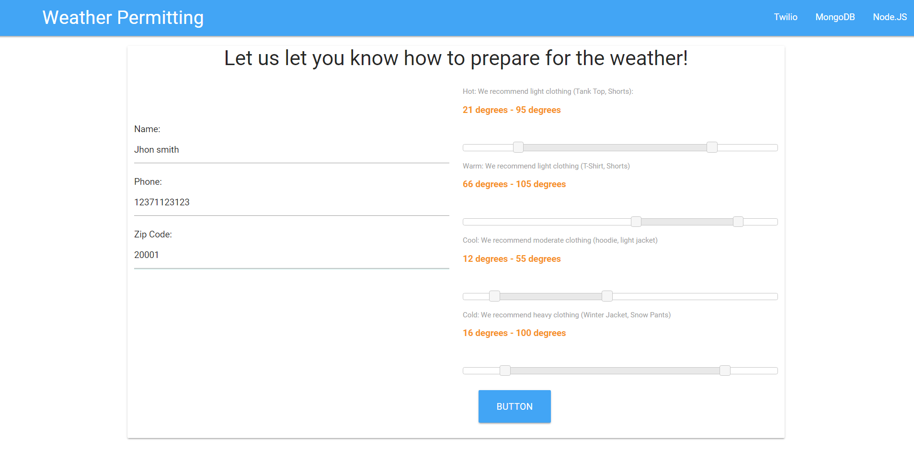
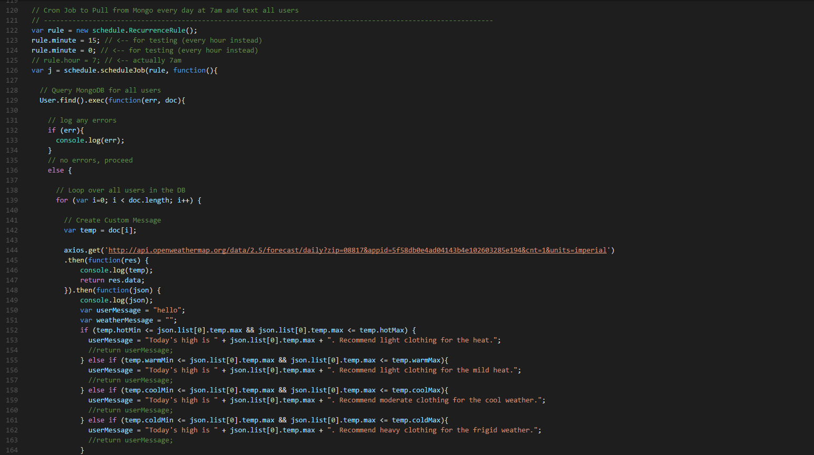
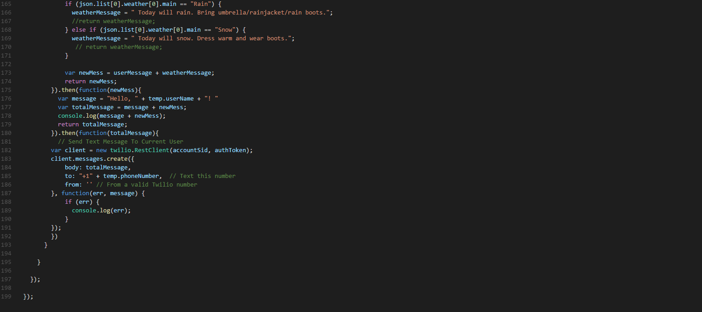

# :sunny: :umbrella: WeatherPermitting :cloud: :snowflake:
A weather app that will text information for preparing for the weather.

## Overview

This is a full web application built on node.js, it allows users to sign up and receive text messages for upcoming weather condition with a custom message for the appropriate clothing to wear.

## Homepage

## Functionality
The app is built on the `NodeJs` environment. It uses several apis including the `twilio` and `weather-api`. The database we used was `mongoDB` and for the styling we used `materialize-css`.

## Cloning down the repo
If you wish to clone the app down to your local machine...
  1. Ensure that you have mongoDB set up on your laptop as well as Node.
  2. The database is called weatherDB.
  3. Once you are set up, `cd` into this repo and run `npm install`.
  4. Afterward, run `npm start`.
  5. Then, navigate to `localhost:80800` in your browser.

## Screenshots

### Sign up for text messages

### Form in used

### Code

### Code - 2

## Tech used

    "axios": "^0.16.1",
    "body-parser": "^1.17.1",
    "express": "^4.14.0",
    "mongoose": "^4.9.5",
    "morgan": "^1.8.1",
    "node-fetch": "^1.6.3",
    "node-schedule": "^1.2.1",
    "twilio": "^2.11.1"

## Authors
*Hackathon Group Project*
* **Gerardo Mestanza** - [GerardoM](https://github.com/Gmes23)

* **Tommy Thompson** - [TomTom](https://github.com/tomtom28)

* **Mario Aburto** - [MarioA](https://github.com/marioaburto10)

* **Matt** - [Matt](https://github.com/mlin2814)